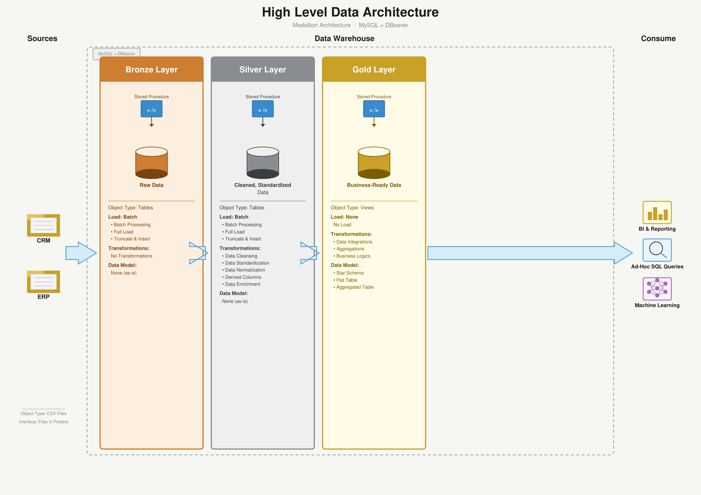
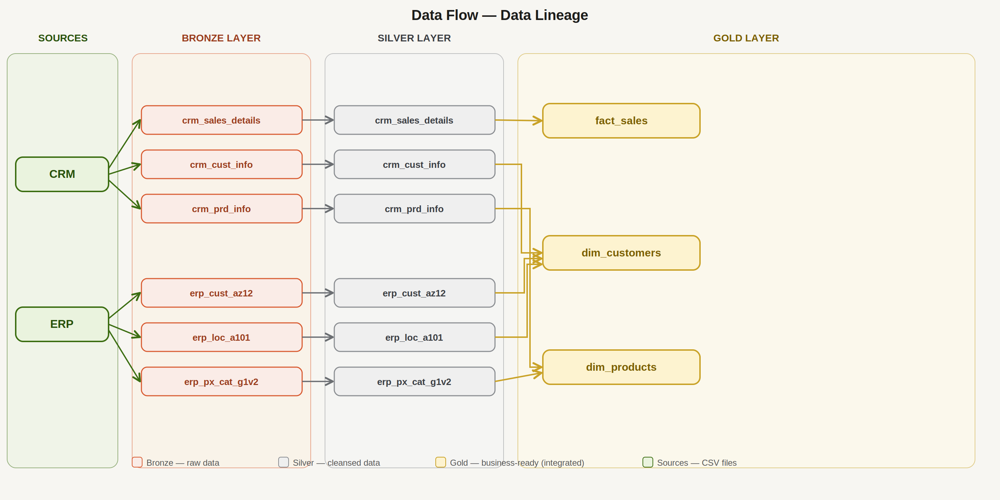
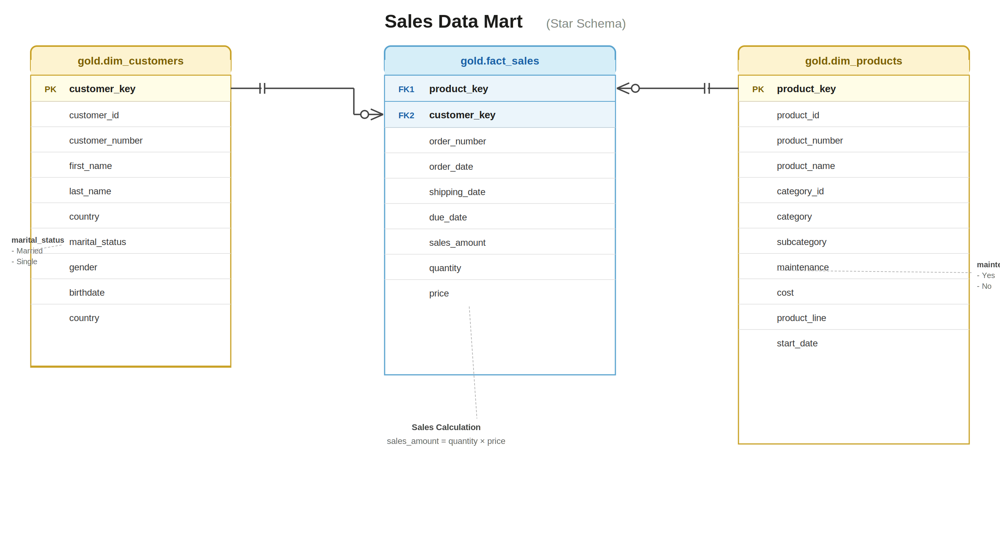

# data-warehouse-sql-project-


> End-to-end data warehouse built with MySQL using Medallion Architecture
> (Bronze → Silver → Gold), covering ETL pipelines, data modeling, and 
> analytical reporting.

---

## 🏗️ Architecture



The project follows **Medallion Architecture** with three distinct layers:

- **Bronze Layer** — Raw data ingested as-is from source systems (ERP & CRM)
- **Silver Layer** — Cleansed, standardized, and normalized data
- **Gold Layer** — Business-ready star schema optimized for analytics

---

## 🔄 Data Flow & Layer Process



---

## 📖 Project Overview

This project simulates a real-world data warehouse workflow, covering:

1. **Data Architecture** — Designing a modern warehouse using Medallion Architecture
2. **ETL Pipelines** — Extracting, transforming, and loading data across layers
3. **Data Modeling** — Building fact and dimension tables in a star schema
4. **Analytics & Reporting** — SQL-based insights on customer, product, and sales data

---

## 🛠️ Tech Stack

| Tool | Purpose |
|------|---------|
| MySQL | Database engine |
| DBeaver | SQL client & database management |
| Git / GitHub | Version control |
| Draw.io | Architecture diagrams |

> **Note:** This project uses MySQL instead of SQL Server.
> Since MySQL does not support schemas the same way SQL Server does,
> three separate databases are used (bronze, silver, gold) to achieve
> the same logical layer separation.

---

## 🚀 Layer Breakdown

### 🥉 Bronze Layer — ✅ Complete

Ingested raw data from two source systems into the warehouse with no transformations.

- Built 6 raw tables — 3 from CRM, 3 from ERP — mirroring source CSV structure exactly
- Used `TRUNCATE → LOAD DATA LOCAL INFILE` pattern for full, repeatable loads
- Validated row counts and column positions after each load
- Adapted from SQL Server (`BULK INSERT`) to MySQL (`LOAD DATA LOCAL INFILE`)


### 🥈 Silver Layer — ✅ Complete

Cleansed and standardized the raw bronze data, making it reliable and consistent.

- Applied data type standardization across all tables (e.g. date integers → proper DATE values)
- Fixed data quality issues — nulls, invalid values, inconsistent codes (gender, marital status, country)
- Removed duplicate records 
- Loaded clean results into the silver layer tables

### 🥇 Gold — Star Schema & Analytics ✅

Business-ready data modeled into a star schema for reporting and analysis.


- Explore business objects | Understand how silver tables connect across CRM and ERP |
- Build dimensions | `dim_customers` (CRM + ERP joined) · `dim_products` (CRM + ERP joined) |
- Build fact table | `fact_sales` — transactional records with all foreign keys |
- Validate integration | Check row counts, join integrity, no orphaned keys | Data model diagram

---

## 📂 Repository Structure
```
data-warehouse-sql-project/
│
├── datasets/
│   ├── source_crm/                    # Raw CRM CSV files
│   └── source_erp/                    # Raw ERP CSV files
│
├── docs/
│   ├── data_architecture.png          # Medallion architecture diagram
│   ├── data_architecture.pdf
│   ├── data_catalog.pdf               # Field descriptions and metadata
│   ├── data_flow.png                  # Data lineage across all layers
│   ├── data_layers_table.pdf          # Layer specifications reference
│   ├── data_model.png                 # Gold layer star schema diagram
│   ├── layer_process.png              # Step-by-step layer process diagram
│   └── naming_conventions.pdf        # Naming standards for tables and columns
│
├── scripts/
│   ├── bronze/                        # Scripts for extracting and loading raw data
│   ├── silver/                        # Scripts for cleaning and transforming data
│   └── gold/                          # Scripts for creating analytical models
│
├── tests/
│   ├── quality_checks_silver.sql      # Silver layer data quality validation
│   └── quality_checks_gold.sql        # Gold layer data quality validation
│
├── LICENSE
└── README.md
```
---
